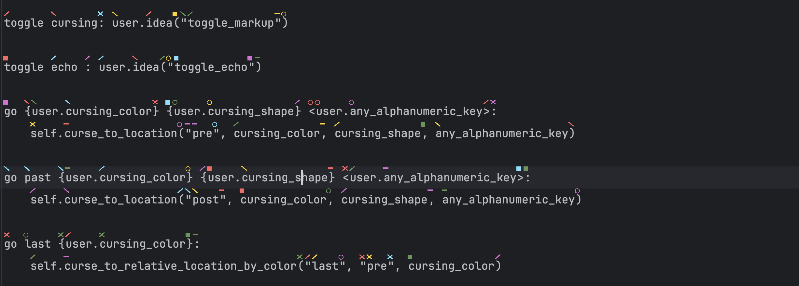

# cursing_less_talon

This project provides advanced navigation and text manipulation in IntelliJ using decorations on 
characters within editors. Basic functionality is mostly provided by [Talonhub/community](https://github.com/talonhub/community),
although this project (and its required [counterpart](https://github.com/msedgren/cursing_less)) include 
significant additional features.

Example:

## Installation
1. Clone this repository to `~/.talon/user`
2. Follow the steps to build and install the [Cursing Less IntelliJ Plugin](https://github.com/msedgren/cursing_less)
Note: this will eventually be published to the marketplace.
3. Consider adjusting the line height to give more space for the tokens: Settings -> Editor -> Font. A value 0.2
higher than the default should work well (1.4).

## Usage

Commands mostly follow a structure of command color shape key.

Default colors are red, purple, green, blue, and yellow.

The defined shapes are square, circle, line, 'X', slash, and backslash.

Decorations are prioritized based on the cursor position. This means that in dense sections with lots of repetition,
will first be added new the cursor. This is due to the nature of a limited number of decoration combinations being possible.

## Commands
Note: commands are still being added and will be added in the future.

Note: Only commands add by this plugin but not present in [Talonhub/community](https://github.com/talonhub/community) are listed below.

### Turning things on and off
- toggle cursing: enable or disable text decorations.
- toggle echo: turn on or off echoing commands in IntelliJ. This is useful for debugging.

### Navigation
- go color shape key: move the cursor to the specified color, shape, and key position.  
For example: `go red square each` will move the cursor to the e character with a red square above it. 
- go past color shape key: move the cursor just past the token with the specified color, shape, and key position.   
For example: `go past red square each` will move the cursor past the token with an 
e character with a red square above it. 
- go last color: move the cursor to the last token with the specified color.  
For example: `go last red` will move the cursor to the last token with a red square above it. 
- go past last color: move the cursor just past the last token with the specified color.  
For example: `go past last red` will move the cursor just past the last token with a red square above it. 
- go next color: move the cursor to the next token with the specified color.  
For example: `go next red` will move the cursor to the next token with a red square above it. 
- go past next color: move the cursor just past the next token with the specified color.  
For example: `go past next red` will move the cursor just past the next token with a red square above it.

### Selecting
- select color shape key: select the token at the specified color, shape, and key position.  
For example: `select red square each` will select the token with an e character with a red square above it.
- select until color shape key: select from the current location until the end (if beyond) or beginning (if behind)
of the token at the specified color, shape, and key position.  
For example: `select until red circle red` will select from the current position until  the token with
an r character with a red circle above it.

### Copying
- copy color shape key: copy the token at the specified color, shape, and key position.  
For example: `copy red square each` will copy the token with an e character with a red square above it.
- copy until color shape key: copy from the current location until the end (if beyond) or beginning (if behind)
of the token at the specified color, shape, and key position.  
For example: `copy until yellow circle air` will copy from current position until the token with
an a character with a yellow circle above it.

### Cutting
- cut color shape key: cut the token at the specified color, shape, and key position.  
  For example: `cut red square each` will cut the token with an e character with a red square above it.
- cut until color shape key: cut from the current location until the end (if beyond) or beginning (if behind)
  of the token at the specified color, shape, and key position.  
  For example: `cut until yellow circle air` will select the token with an a character with a yellow circle above it.
- cut until color shape key: cut from the current location until the end (if beyond) or beginning (if behind)
  of the token at the specified color, shape, and key position.  
  For example: `cut until yellow circle air` will cut from current position until the token with
  an a character with a yellow circle above it.

### Clearing
- clear color shape key: clear the token at the specified color, shape, and key position.  
  For example: `clear red square each` will clear the token with an e character with a red square above it.
- clear until color shape key: clear from the current location until the end (if beyond) or beginning (if behind)
  of the token at the specified color, shape, and key position.  
  For example: `clear until yellow circle air` will clear from current position until the token with
  an a character with a yellow circle above it.

### Adding Cursors
- add cursor color shape key: Add a new cursor at the specified color, shape, and key position.  
  For example: `add cursor red square each` will add a new cursor before the token with an e character with a red square
above it.
- add number cursors above: Add the given number of cursors above the primary at the given column.  
For example: `add 5 cursors above` will add 5 cursors above the current primary cursor.
- add number cursors below: Add the given number of cursors below the primary at the given column.  
For example: `add 5 cursors below` will add 5 cursors below the current primary cursor.

### Removing Cursors
- remove cursor number: Remove the cursor nth cursor from the editor.  
  For example: `remove curosr 1` will remove the first cursor from top/left to bottom in the editor.
