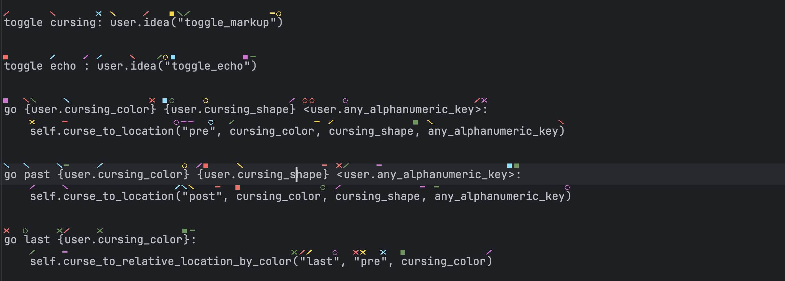

# cursing_less_talon

This project provides advanced navigation and text manipulation in IntelliJ using decorations on 
characters within editors. Basic functionality is mostly provided by [Talonhub/community](https://github.com/talonhub/community),
although this project (and its required [counterpart](https://github.com/msedgren/cursing_less)) include 
significant additional features.

Example:

## Installation
1. Clone this repository to `~/.talon/user`
2. Follow the steps to build and install the [Cursing Less IntelliJ Plugin](https://github.com/msedgren/cursing_less)
3. Adjust the line height to give more space for the tokens: Settings -> Editor -> Font. A value 0.2 or 0.3
higher than the default should work well (1.4 or 1.5).
4. Enable Reader Mode and check Increased Line Height.
5. Optionally check plugin settings to alter colors, shapes, and pattern matching for tokens. 

## Usage

Commands mostly follow a structure of verb color shape key.

Default colors are red, purple, green, blue, and yellow. New colors may be defined but will need to be added to the
color list.

The defined shapes are square, circle, line, 'X', slash, backslash, triangle, crescent, heart, and star.

Decorations are prioritized based on the cursor position. This means that in dense sections with lots of repetition,
decorations will first be added nearer to the cursor. This is due to the limited number of decoration
combinations that are possible.

## Commands
Note: commands are still being added and refined.

Note: Only commands added by this plugin but not present in [Talonhub/community](https://github.com/talonhub/community) are listed below.

### Turning things on and off
- toggle cursing: enable or disable text decorations.
- toggle echo: turn on or off echoing commands in IntelliJ. This is useful for debugging.

### Navigation
- go color shape key: move the cursor to the specified color, shape, and key position.  
For example: `go red square each` will move the cursor to the e character with a red square above it. 
- go past color shape key: move the cursor just past the token with the specified color, shape, and key position.   
For example: `go past red square each` will move the cursor past the token with an 
e character with a red square above it. 
- go last color: move the cursor to the last token with the specified color.  
For example: `go last red` will move the cursor to the last token with a red square above it. 
- go past last color: move the cursor just past the last token with the specified color.  
For example: `go past last red` will move the cursor just past the last token with a red square above it. 
- go next color: move the cursor to the next token with the specified color.  
For example: `go next red` will move the cursor to the next token with a red square above it. 
- go past next color: move the cursor just past the next token with the specified color.  
For example: `go past next red` will move the cursor just past the next token with a red square above it.
- go declaration color shape key: move the cursor to the declaration of the token at the specified color, shape, and key position.  
For example: `go declaration red square each` will move the cursor to the declaration of the token with an e character with a red square above it.

### Selecting
- select color shape key: select the token at the specified color, shape, and key position.  
For example: `select red square each` will select the token with an e character with a red square above it.
- select current: select the token at the current cursor position.  
For example: `select current` will select the token where the cursor is currently positioned.
- select until color shape key: select from the current location until the end
of the token at the specified color, shape, and key position.  
For example: `select until red circle red` will select from the current position until  the token with
- select until before color shape key: select from the current location until the beginning
  of the token at the specified color, shape, and key position.  
  For example: `select until before red circle red` will select from the current position until just before the token with
an r character with a red circle above it.
- select color shape key until color shape key: select from the first token to the second token.  
For example: `select red square each until yellow circle air` will select from the token with an e character with a red square above it to the token with an a character with a yellow circle above it.

### Copying
- copy color shape key: copy the token at the specified color, shape, and key position.  
For example: `copy red square each` will copy the token with an e character with a red square above it.
- copy current: copy the token at the current cursor position.  
For example: `copy current` will copy the token where the cursor is currently positioned.
- copy until color shape key: copy from the current location until the end
of the token at the specified color, shape, and key position.  
For example: `copy until yellow circle air` will copy from current position until the token with
an a character with a yellow circle above it.
- copy until before color shape key: copy from the current location until the beginning
  of the token at the specified color, shape, and key position.  
  For example: `copy until before yellow circle air` will copy from current position until just before the token with
  an a character with a yellow circle above it.
- copy color shape key until color shape key: copy from the first token to the second token.  
For example: `copy red square each until yellow circle air` will copy from the token with an e character with a red square above it to the token with an a character with a yellow circle above it.

### Cutting
- cut color shape key: cut the token at the specified color, shape, and key position.  
  For example: `cut red square each` will cut the token with an e character with a red square above it.
- cut current: cut the token at the current cursor position.  
  For example: `cut current` will cut the token where the cursor is currently positioned.
- cut until color shape key: cut from the current location until the end
  of the token at the specified color, shape, and key position.
  For example: `cut until yellow circle air` will select the token with an a character with a yellow circle above it.
- cut until before color shape key: cut from the current location until the beginning
  of the token at the specified color, shape, and key position.
  For example: `cut until before yellow circle air` will select until just before the token with an a character with a yellow circle above it.
- cut color shape key until color shape key: cut from the first token to the second token.  
  For example: `cut red square each until yellow circle air` will cut from the token with an e character with a red square above it to the token with an a character with a yellow circle above it.

### Clearing
- clear color shape key: clear the token at the specified color, shape, and key position.  
  For example: `clear red square each` will clear the token with an e character with a red square above it.
- clear current: clear the token at the current cursor position.  
  For example: `clear current` will clear the token where the cursor is currently positioned.
- clear until color shape key: clear from the current location until the end (if beyond) or beginning (if behind)
  of the token at the specified color, shape, and key position.  
  For example: `clear until yellow circle air` will clear from current position until the token with
  an a character with a yellow circle above it.
- clear until before color shape key: clear from the current location until the beginning
  of the token at the specified color, shape, and key position.  
  For example: `clear until before yellow circle air` will clear from current position until just before the token with
  an a character with a yellow circle above it.
- clear color shape key until color shape key: clear from the first token to the second token.  
  For example: `clear red square each until yellow circle air` will clear from the token with an e character with a red square above it to the token with an a character with a yellow circle above it.

**The commands to add and remove coursers, mark text, and swap text below are a bit experimental.
I am still playing with them a bit and I'm not sure yet how exactly they should function**

### Adding Cursors
- add cursor color shape key: Add a new cursor at the specified color, shape, and key position.  
  For example: `add cursor red square each` will add a new cursor before the token with an e character with a red square
above it.
- add number cursor(s) above: Add the given number of cursors above the primary at the given column.  
For example: `add 5 cursors above` will add 5 cursors above the primary cursor.
- add number cursor(s) below: Add the given number of cursors below the primary at the given column.  
For example: `add 1 cursor below` will add 1 cursor below the primary cursor.

### Removing Cursors
- remove cursor number: Remove the cursor nth cursor from the editor.  
  For example: `remove curosr 1` will remove the first cursor from top/left to bottom in the editor.
- remove all secondary cursors: Remove all cursors below the first cursor.  
  For example: `remove all secondary cursors`.

### Marking Cursors
- mark number: Mark the primary selection with the number given.  
  For example: `mark 1` will mark the selected content and store it in mark 1.
- past mark number: Paste the content of the mark with the given number at the current location.  
  For example: `past mark 1` will paste the content of the mark 1 at the current cursor position.
- remove mark number: Remove the mark with the given number.  
  For example: `remove mark 1` will remove the mark 1.
- remove all marks: Remove all marks from the editor.
  For example: `remove all marks` will clear all marks that have been set.
- toggle marks window: Toggle the display of the marks tool window.  
  For example: `toggle marks window` will show or hide the marks tool window.

### Swapping
- swap selections number number: Swap the selections of two cursors given by their numbers.  
  For example: `swap selections 1 2` will swap the selections of cursor 1 and cursor 2.
- swap selection_type color shape key with color shape key: Swap a token (color, shape, and character) with another token.  
  For example: `swap select red square each with blue circle bee` will swap the token with an e character with a red square above it with the token with a b character with a blue circle above it.
